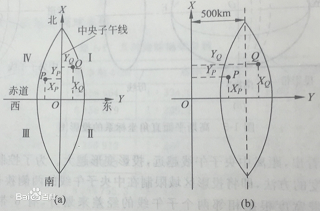
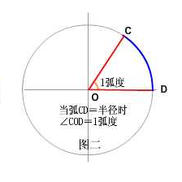
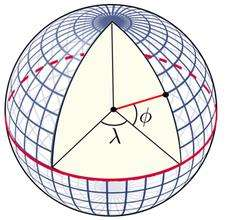

## Cesium中的几种坐标和相互转换

> 1、平面坐标系（Cartesian2）

    new Cesium.Cartesian2(x, y)
    

    
> 2、笛卡尔空间直角坐标系-世界坐标（Cartesian3）

    new Cesium.Cartesian3(x, y, z)
   

    
> 3、弧度（Cartographic）

    new Cesium.Cartographic(longitude, latitude, height)   
    
    注：这里的经纬度是用弧度表示的，经纬度其实就是角度。弧度即角度对应弧长是半径的倍数。
    角度转弧度: π / 180 × 角度 
    弧度变角度: 180 / π × 弧度 
   

    
> 4、经纬度（longitude，latitude）
   
   地理坐标系，坐标原点在椭球的质心。
   
   经度：参考椭球面上某点的大地子午面与本初子午面间的两面角。东正西负。
   
   纬度：参考椭球面上某点的法线与赤道平面的夹角。北正南负。
   
   
   
## 坐标转换

> 1.经纬度转换为世界坐标

    第一种方式：直接转换:
    Cesium.Cartesian3.fromDegrees(longitude, latitude, height, ellipsoid, result) 
    
    第二种方式：先转换成弧度再转换
    var ellipsoid = viewer.scene.globe.ellipsoid;
    var cartographic = Cesium.Cartographic.fromDegrees(lng,lat,alt);
    var cartesian3 = ellipsoid.cartographicToCartesian(cartographic);
  
> 2.世界坐标转换为经纬度

    var ellipsoid = viewer.scene.globe.ellipsoid;
    var cartesian3 = new Cesium.cartesian3(x,y,z);
    var cartographic = ellipsoid.cartesianToCartographic(cartesian3);
    var lat = Cesium.Math.toDegrees(cartograhphic.latitude);
    var lng = Cesium.Math.toDegrees(cartograhpinc.longitude);
    var alt = cartographic.height;
    
> 3.弧度和经纬度

    经纬度转弧度：
    Cesium.CesiumMath.toRadians(degrees) 
    弧度转经纬度：
    Cesium.CesiumMath.toDegrees(radians) 
    
> 4.屏幕坐标和世界坐标相互转换

    屏幕转世界坐标：
    var pick1= new Cesium.Cartesian2(0,0);
    var cartesian = viewer.scene.globe.pick(viewer.camera.getPickRay(pick1),viewer.scene);    
    注意这里屏幕坐标一定要在球上，否则生成出的cartesian对象是undefined
    
    世界坐标转屏幕坐标
    Cesium.SceneTransforms.wgs84ToWindowCoordinates(scene, Cartesian3);
    结果是Cartesian2对象，取出X,Y即为屏幕坐标。
    
> 5.Cartesian2

    Cesium.Cartesian2.fromCartesian3(cartesian, result)→ Cartesian2
    
> 6.Cartesian3  

    I：经纬度坐标（WGS84）→ Cartesian3
    Cesium.Cartesian3.fromDegrees(longitude, latitude, height, ellipsoid, result) → Cartesian3
    
    II：弧度坐标→ Cartesian3
    Cesium.Cartesian3.fromRadians(longitude, latitude, height, ellipsoid, result) → Cartesian3
    
> 7.Cartographic

    I：Cartesian3→ Cartographic
    Cesium.Cartographic.fromCartesian(cartesian, ellipsoid, result) → Cartographic
    
    II：经纬度坐标（WGS84）→ Cartographic
    Cesium.Cartographic.fromDegrees(longitude, latitude, height, result) → Cartographic   
    
    另外，经纬度坐标和弧度坐标也可以通过Cesium.Math来转换
    Cesium.CesiumMath.toDegrees(radians) → Number
    Cesium.CesiumMath.toRadians(degrees) → Number        